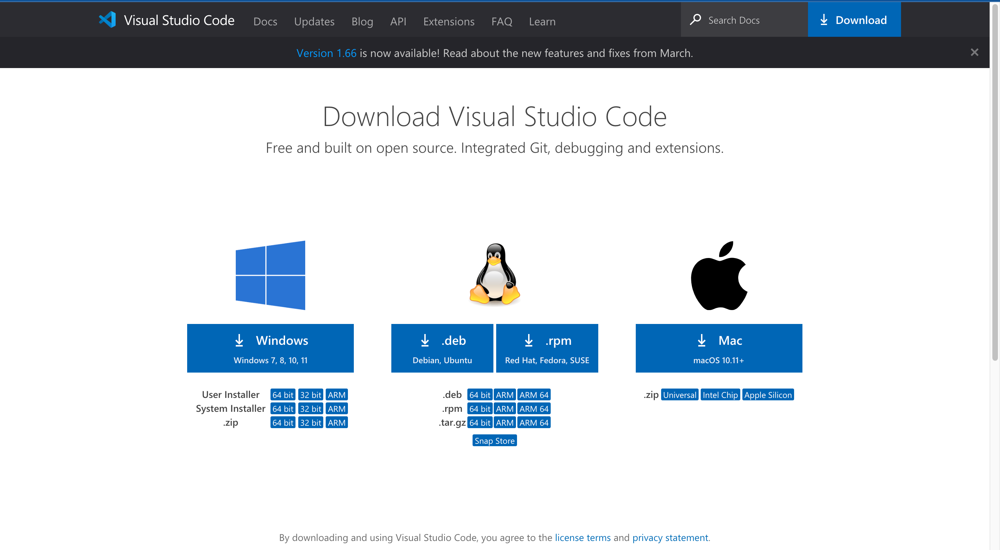
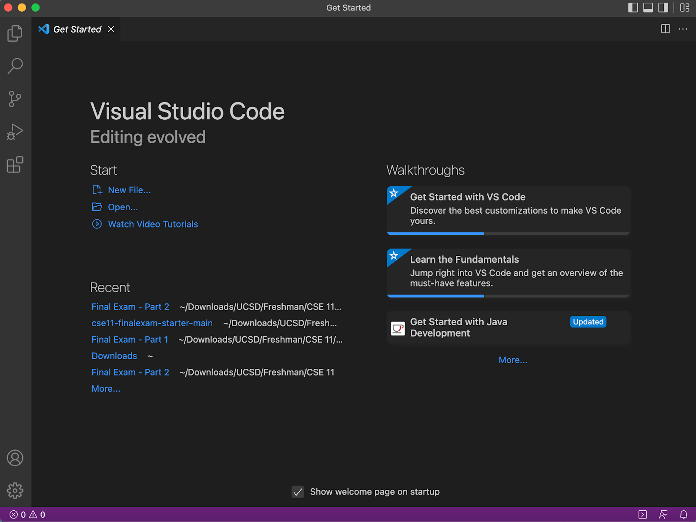
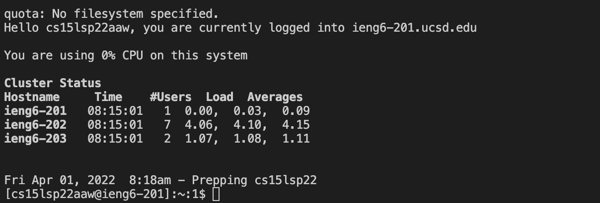
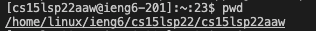
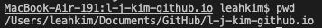
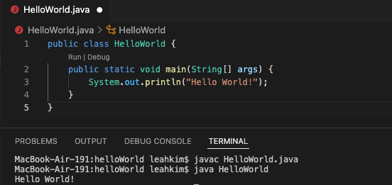
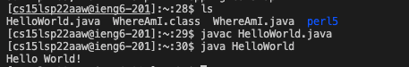
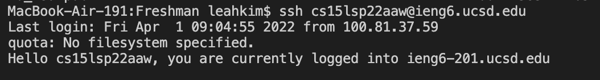
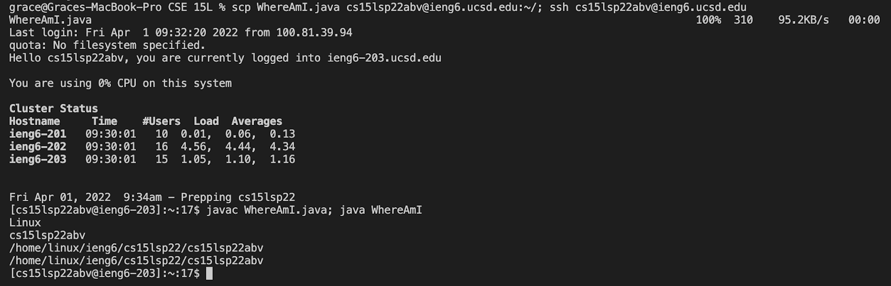

Lab Report Week 2
====
This is a tutorial to set up remote access to ieng6.

Installing VScode
---
The first step in this process is installing VS Code, which can be done by clicking on this [link](https://code.visualstudio.com/Download). 

The link should bring you to the page below, where you can download the correct version of VS Code for your computer's operation system. 

 

Once it is done downloading, follow the instructions on the installer and open VS Code. The starting window should look something like the image below.

 

Remotely Connecting
---
On VS Code, toggle the integrated terminal using the navigation bar on the bottom. Using the terminal, type the command, `$ ssh username@ieng6.ucsd.edu` where "username" is your class specific username, then press enter.

 If you get a message similar to `"the authenticity of host ieng6.ucsd.edu can't be established, are you sure you want to continue connecting?"`, type yes and press enter. Type in your password into the terminal to complete the login process, and your terminal display should look something like the image below.

  

Trying Some Commands
---
Now try running some commands, such as `cd`, `mkdir`, `ls`, and `pwd` on the server. Also try running those commands again on your computer (type `exit` in the terminal or press Ctrl-D to log out of the server) and see how they are similar or different.

 

For example, the above image shows the result of running the pwd command on the server, while the image below shows the same command running on the computer.

 

Moving Files with scp
---
To try moving files between your computer and the server, first create and run a java file (the image below shows a simple "Hello World" file). 

 

Then, in the terminal, type in the command `scp filename.java username@ieng6.ucsd.edu:/` where file name is the name of the file you created and username is your class username; this will create a copy of the file on the server.

Now, if you log into the server again, you should be able to see the file using `ls` and run the file itself on the server.

 

Setting an SSH Key
---
Setting up an SSH key will make it easier to log in to the server; to do this, on your computer terminal, type `$ ssh-keygen` and press enter repeatedly until the public key has been saved (do not enter a passphrase). 

After that, log into the server again and type the command `mkdir .ssh`, log out again, and type the command scp /Users/user/.ssh/id_rsa.pub username@ieng6.ucsd.edu:~/.ssh/authorized_keys where 'user' is your computer username and 'username' is your class specific username.

Now try logging in and out of the server; you should be able to do this without typing in your password, similar to as shown by the image below.

 

Optimizing Remote Running
---
To make the process of moving files easier, try to come up with an efficient process to copy a file onto the remote server and running it. To help, consider tricks like using semicolons to write multiple commands on one line or using the up arrow to recall the last command you used. Below is an example of copying a file to the server using two lines and five keystrokes.

 