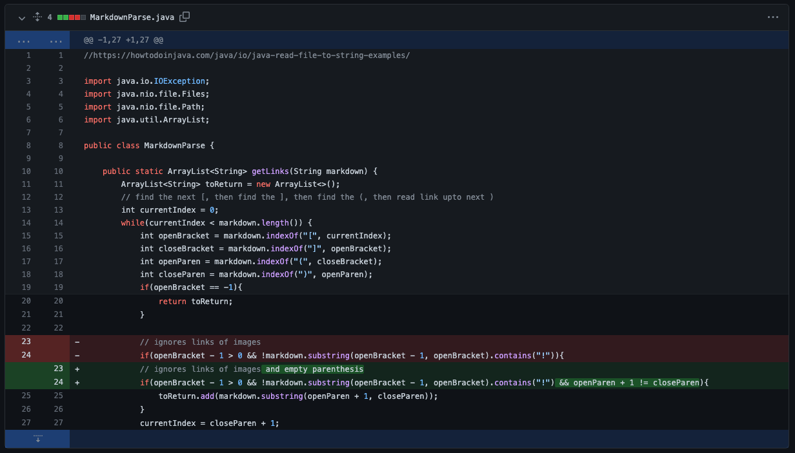
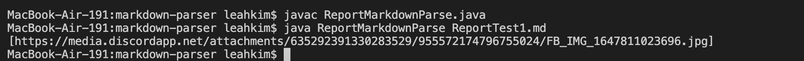
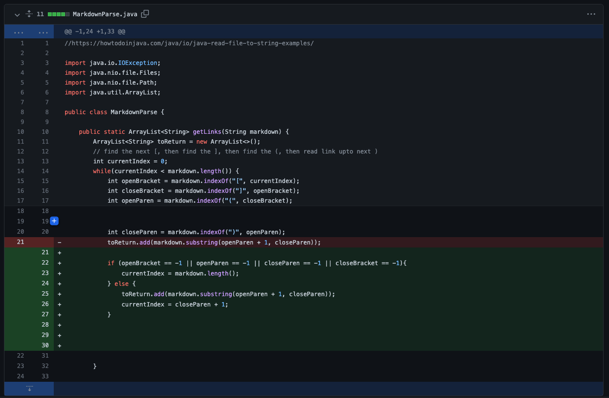
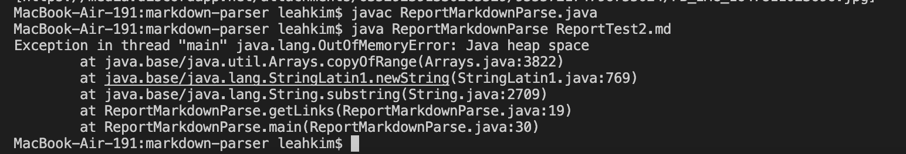
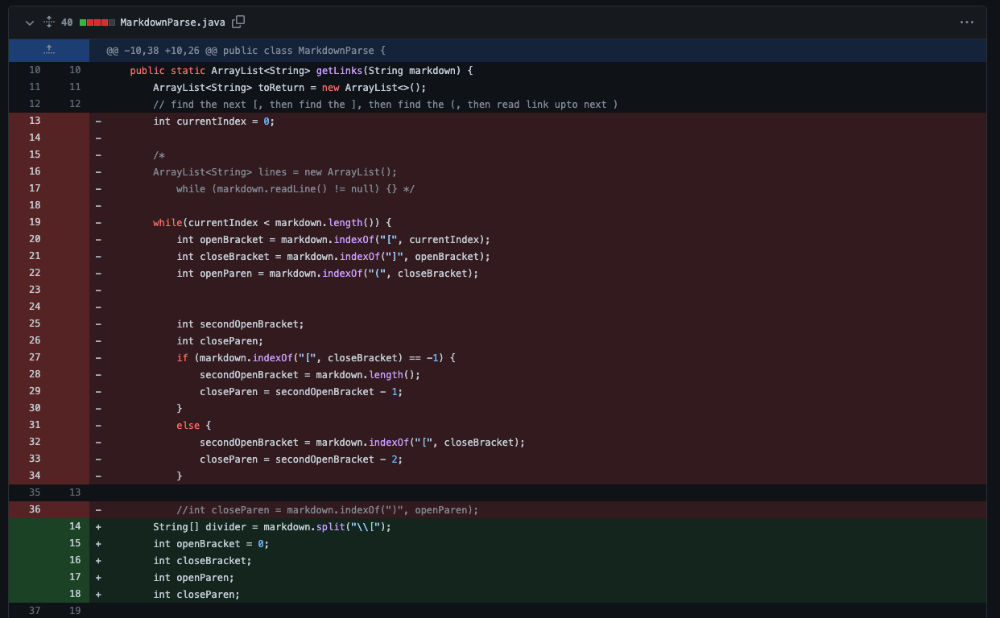
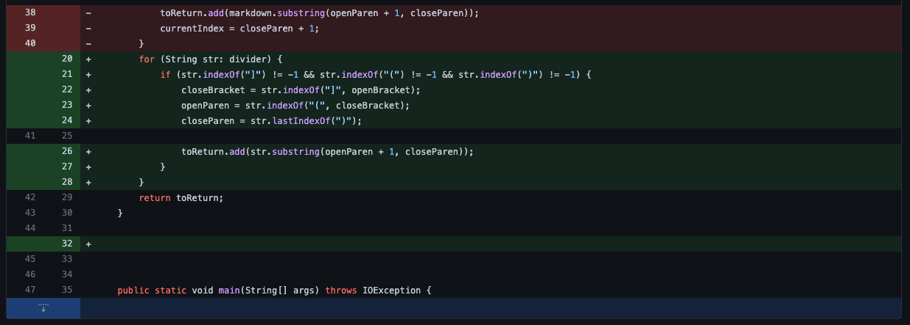
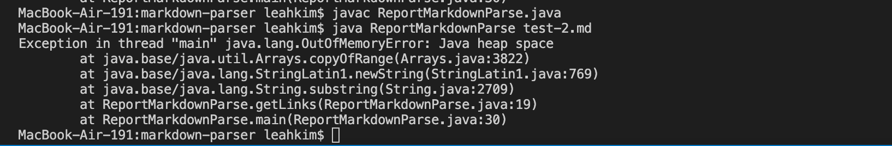

Lab Report Week 4
====
Bugs, Symptoms, and Code Changes

1st Code Change
---
Credit goes to Grace Yang in my group for producing the tests and the code changes shown in this section.
All commits and code can be found [here](https://github.com/yyygrace/markdown-parser/commits/main).

The image below show the changes made to the Markdown.parser code:

Here is the [link](https://github.com/yyygrace/markdown-parser/commit/7b26dc026f6abda7f007b42a1592d0ae0878808b) to the github page with the commit.

The failure-inducing imput that prompted these changes are linked [here](https://github.com/yyygrace/markdown-parser/blob/46d9b7d058d317f53565a94d4c17c3c534784221/image-tester.md). The symptoms for this imput can be shown via the output of running the imput at the commandline, which is shown below. 

The bug this test highlighted was that Markdown-Parser will return the link of an image instead of displaying it on the page, with its symptom being printing the link of the image as part of the arrray in the terminal. The only thing separating a link from an image in the markdown syntax is a "!" befor the open bracket, and the code before the changes did not take that into account. The failure inducing imput showcased this as it only contained an image, which was treated as a link.

2nd Code Change
---
Credit goes to Sanika Bharvirkar from my group for producing the tests and the code changes displayed in this section.
All commits and code can be found [here](https://github.com/imsanika03/markdown-parser/commits/main).

The changes made to the Markdown-parser method is shown below:

This is the [link](https://github.com/imsanika03/markdown-parser/commit/e4a90a41a6fdf8f8c6940e4462043fa73c58e2c7) to the github page with the commit.

These changes were made as a result from the failure-inducing imput linked [here](https://github.com/imsanika03/markdown-parser/blob/ec3625f228e58e152f9997596da53b70b3b09a0d/test2-file.md). The output that is produced with the code before the changes can be seen below.

The bug this test highlighted was that Markdown-Parser will never terminate its loop if there is additional text after the last link in the test file, and continue running until the computer runs out of memory, hence producing a java.lang.OutOfMemoryError as a symptom. The failure-inducing output has text after the final link, and will hence trigger the bug when it is run. 

3rd Code Change
---
I did the tests and code changes for this section.

The changes made to the Markdown-parser method is shown below:

These changes were made as a result from the failure-inducing imput linked [here](https://github.com/l-j-kim/markdown-parser/blob/main/test-2.md?plain=1). When imputed into the terminal and ran with the original MarkdownParse code, the terminal will produce the output shown below.  

The bug in this test is that the code assumes the link text ends at the first closed parenthesis, and will hence truncate the link early. If the last link contains parenthesis, it will cause the program to run an infinite loop and run out of memory, producing the java.lang.OutOfMemoryError as a symptom. For the failure-inducing imput used, there were two links both containing parenthesis, which caused the program to throw the java.lang.OutOfMemoryError. 
