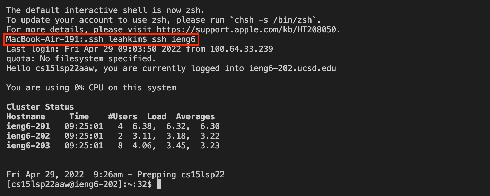
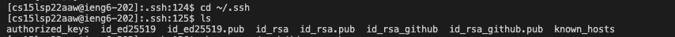
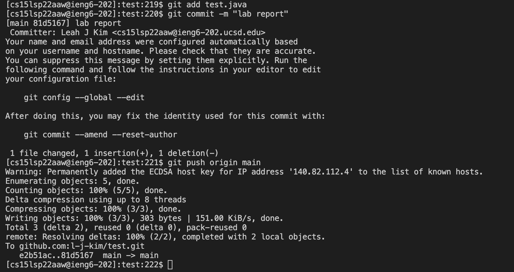

Lab Report Week 6
====
Access from Commandline

Streamline ssh Configuration
---
To help streamline ssh configuration, a config file was created and edited as shown below so that the file contained the host name, my username, and a reference to the ssh key for my password. 

This made it so that logging in to ieng6 would by easier. For example, instead of having to type in `$ ssh cs15lsp22aaw@ieng6.ucsd.edu`, I can just type in `ssh ieng6`, and log in. This can be seen by the screenshot below.

Additionally, copying files from my computer to the server is also much simpler. Like before, I only need to type in `scp HelloWorld.java ieng6:` instead of `scp HelloWorld.java cs15lsp22aaw@ieng6.ucsd.edu:~/` as shown below, and when logging into the server afterwards, the copied file can be seen by typing `ls`.

Set up Github Access from ieng6
---
Additionally, to allow access to github repositories from my personal device directly (without github desktop) and the ieng6 server, I added an ssh key to github using a process detailed in this [link](https://docs.github.com/en/authentication/connecting-to-github-with-ssh/adding-a-new-ssh-key-to-your-github-account). The public key created as a result can be seen in the screenshot below. 

On my personal computer, the private key to the account is stored here:

This same process was repeated for the ieng6 server, with the private keys being stored here:

After these processes were completed, it became possible to use the command `git push origin main` while logged into the ieng6 server, sa can be seen below.

Copy Whole Directories with scp -r
---
It is also possible to copy entire directories from my personal device to the ieng6 server, which is more efficient then copying them one at a time. To do this, `scp -r . cs15lsp22aaw@ieng6.ucsd.edu:~/markdown-parse`is run on the commandline, which produces an output such as shown below:

After that, on the ieng6 server, the directory (which is markdown-parse in this case) can be compiled by `javac -cp .:lib/junit-4.13.2.jar:lib/hamcrest-core-1.3.jar MarkdownParseTest.java` on the command line, and then run using `java -cp .:lib/junit-4.13.2.jar:lib/hamcrest-core-1.3.jar org.junit.runner.JUnitCore MarkdownParseTest`. This will run all the JUnit tests created in this directory, as shown below.

To make things more efficient, all the aforementioned commands in this section can be run at once by separating each command using a semicolon. The resulting command will look like this:
> scp -r . cs15lsp22aaw@ieng6.ucsd.edu:~/markdown-parse; ssh cs15lsp22aaw@ieng6.ucsd.edu cd markdown-parse; javac -cp .:lib/junit-4.13.2.jar:lib/hamcrest-core-1.3.jar MarkdownParseTest.java; java -cp .:lib/junit-4.13.2.jar:lib/hamcrest-core-1.3.jar org.junit.runner.JUnitCore MarkdownParseTest

The results of running this command can be seen below:

 

