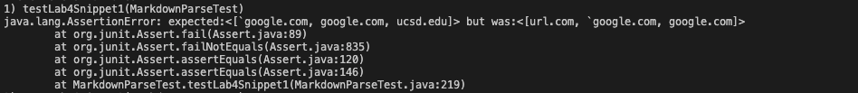
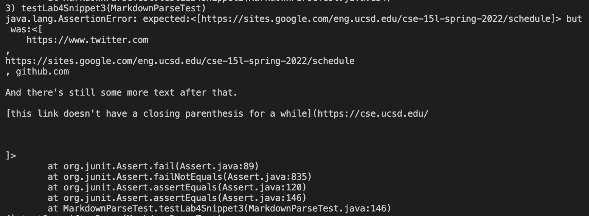

Lab Report Week 8
====
Testing MarkdownParser

Snippet 1
---
Pasting the snippet into the [CommonMark Demo Site](https://spec.commonmark.org/dingus/) produced this result:

From this, it was concluded that a test using the snippet should produce the list: 
>{`google.com, google,com, ucsd.edu}. 

A file `lab4-test1.md` was created containing the snippet and the test `testLab4Snippet1()` was created to test if the list produced by MarkdownParse was the same as the expecteed list. The test is shown below.

The image below shows the result of running the test for our implementation of MarkdownParse. The test did not pass, containing the link, `url.com` but not `ucsd.edu`.

This image shows the result of running the test for the implementation we reviewed in week 7. This test also did not pass and had the same output. 

There may be a small code change that can be implemented to make MarkdownParse work for Snippet 1 and other cases involving backticks. For example, there could be an if statement checking for the presense of backticks and where they are (such as within or outside the brackets and parenthesis) and from there, determine whether or not to add the link to the list or to ignore it and move on.

Snippet 2
---
The shown output from the [CommonMark Demo Site](https://spec.commonmark.org/dingus/) for snippet 2 is shown below.

This output helped determine that the expected links to show up in the produced list are: 
>{a.com, a.com(()), example.com}

Snippet 2 was copied to the file `lab4-test2.md` and the `testLab4Snippet1()` method was created to test if MarkdownParse compiled the expected list. The test is shown below.

After running the test for our implementation, the output produced by the terminal is shown below. This test did not pass, as the actual output only had `a.com((`. 

The test did not pass for the other implementation either. The actual output was different though, containing `a.com` and `a.com((`.

There likely is not a small code change that will make this test pass, and changing MarkdownParse will likely bee a more involved change. This is because currently, the method is designed to find the first open/close brackets and open/close parentheses from a given index. Also, there is not a simple way to check for the presence of more than one bracket or parenthesis and then modify the string of interest so that it both doesn't cut off part of the link or include more characters than it should in the final link without completely modifying the originl method.

Snippet 3
---

The [CommonMark Demo Site](https://spec.commonmark.org/dingus/) output for Snippet is shown below. 

Using this output helped determine that the expected output of MarkdownParse should be: 
> {https://sites.google.com/eng.ucsd.edu/cse-15l-spring-2022/schedule}

With this in mind, the file `lab4-test3.md` file was created hosting the content in Snippet 3, and the test `testLab4Snippet3()` was created to check if the actual output of MarkdownParse was the same as the expected output. The test can be seen below.

Running this test on our implementation of MarkdownParse produces the output shown below, indicating that the test did not pass.

Running the test on the implementation we reviewed in Week 7 shows that the test does not pass for their method either. 

It may be possible to add a small modification to the method to account for linebreaks in between the parentheses and brackets. A potential idea for this modification is a method to check if there is a linebreak anywhere in between the open bracket and close parenthesis (with \n), and if there is, to ignore it and move on to the next line segment.