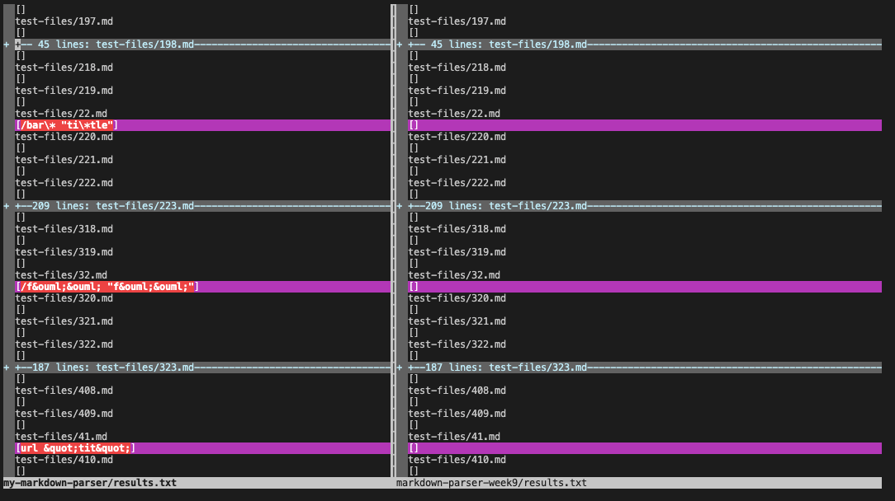
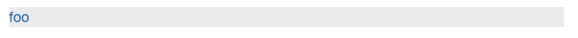
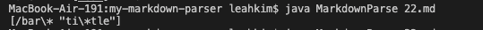
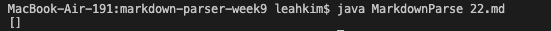
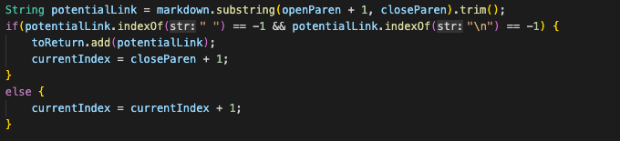
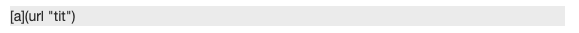
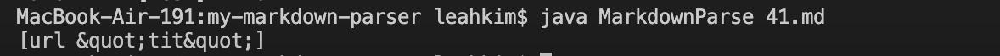
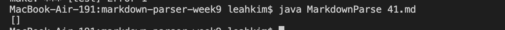
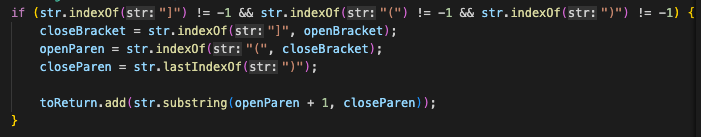

Lab Report Week 10
====
Markdown Parse Test Differences Between Multiple Files

Finding Different Tests
---
My implementation of MarkdownParser is titled `my-markdown-parser`, while the implementation given during the Week 9 lab is titled `markdown-parser-week9`. To find tests that provided different results for these two implementations, I first ran `make test` in the command line for both repositories to compile all the classes. After that, I ran `bash script.sh > results.txt`, which stored a list of all the tests within the test-files folder and their results into a .txt file.

 Finally, to compare them, I ran `vimdiff my-markdown-parser/results.txt markdown-parser-week9/results.txt` which showed where in there were differences in the .txt files, coinciding with where the tests produced different results. A snippet from the result can be seen below; my implementation is shown on the left, and the provided implementation is on the right. 

Test 1
---
One of the tests that produced different output is Test 22, which can be found [here](https://github.com/nidhidhamnani/markdown-parser/blob/main/test-files/22.md?plain=1). Pasting the contents of the test in the [CommonMark Demo Site](https://spec.commonmark.org/dingus/) produces this result.

This output shows that the test produces a valid link, and that the implementations should return `[/bar\* "ti\*tle"]` for their output. The result of running the test on my version of MarkdownParser is shown below.

Also, here is the result of running the test on the given implementation.

For this test, my implementation provided the correct output, while the given implemention did not. This is because of a bug in  the given implementation that makess it so it checks to see if the potential list has a space in it or not, adding it if it doesn't and skipping it if it does. Since the text, `[/bar\* "ti\*tle"]` contains a space in it, the given version of MarkdownParse would have excluded it even though the rest of the text is in double quotes and it technically counts as a valid link. The image below shows the code from the given implentation described above.

Test 2
---
A different test whose output differed between the two versions of MarkdownParser is test 41, which can be found [here](https://github.com/nidhidhamnani/markdown-parser/blob/main/test-files/41.md?plain=1). The result the [CommonMark Demo Site](https://spec.commonmark.org/dingus/) produces from this test is shown below.

This output shows that the test does not produce a valid link, so the implementations should not have any links in their output and only produce `[]`. Running the test on my implementation produces this result.

Meanwhile, the output from running the test on the given implementation is shown below.

This time, my implementation produced the wrong result, while the given implementation produced the right one. This is due to a bug in my implementation, where it will consider anything between the first open parenthesis and last closing parenthesis to be part of a valid link no matter what it contains. Hence, even if the text contained something that would invalidate it as a link, like a new line or a space (without the double quotes), my implementation would return it as a link. The code for my implementation is shown below. 

